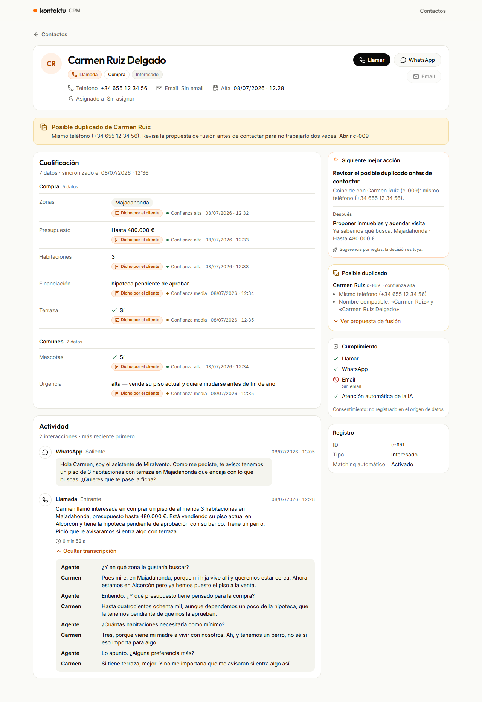

# Ficha de contactos · Reto técnico Kontaktu

La ficha de contacto que un agente inmobiliario abre antes de llamar. Tiene que verse digna con **cualquiera** de
los contactos del dataset, del más rico al más vacío, aunque los datos lleguen "como vienen".



| Contacto rico (c-001) | Casi vacío (c-012) | No llamar (c-013) | Pidió una persona (c-016, móvil) |
|---|---|---|---|
| [captura](docs/capturas/desktop/c-001.png) | [captura](docs/capturas/desktop/c-012.png) | [captura](docs/capturas/desktop/c-013.png) | [captura](docs/capturas/mobile/c-016.png) |

## Cómo correrlo

Requisitos: Node 20+ y pnpm.

```bash
pnpm install
pnpm dev                 # http://localhost:3000
```

| Comando | Qué hace |
|---|---|
| `pnpm test` | 158 tests (Vitest): dominio, servidor, route handlers y contrato con el dataset real |
| `pnpm test:e2e` | 128 E2E (Playwright), escritorio (1280px) y móvil (375px). Con Chrome instalado: `PW_CHANNEL=chrome pnpm test:e2e`; si no, antes `pnpm exec playwright install chromium` |
| `pnpm verify` | typecheck + lint + test + e2e |
| `pnpm inspect:data` | Tabla crudo → normalizado de cada contacto, para revisarla a ojo |

Para probar los estados:
- **Error:** `/contactos/c-001?simular=error`.
- **Carga lenta:** `API_LATENCY_MS=2000 pnpm dev`.
- **Otra organización:** `KONTAKTU_ORG_ID=ORG-0047 pnpm dev`.

Todas las variables están en `.env.example` y son opcionales.

Agente de voz (bonus): ver [`voice-agent/README.md`](voice-agent/README.md).

## Qué hay

| Requisito | Dónde |
|---|---|
| R1 · Listado mínimo | `/contactos`: identidad, origen, última interacción y avisos. Sin búsqueda ni paginación, a propósito |
| R2 · Cabecera robusta | `features/contact-detail/identity-header.tsx`. Nombre con fallback (nombre → teléfono → email → "Contacto sin identificar"), iniciales o icono, origen normalizado, teléfono internacional, alta en hora de Madrid |
| R3 · Cualificación dinámica | `domain/qualification/*`. Pinta **por el tipo del valor**, no por la clave, así que las claves nuevas también salen. Muestra procedencia (dicho por el cliente, editado por una persona, importado, declarado), confianza, verificación y fecha. Lo humano manda |
| R4 · Timeline | `domain/timeline.ts`. Todos los canales (también `EMAIL`), más reciente primero aunque las fechas vengan en 4 formatos, transcripción plegable por turnos, referencia de inmueble resuelta contra el catálogo |
| R5 · Estados | Esqueleto con la forma de la ficha, error con reintento, 404 y ficha vacía que explica qué va a pasar |
| R6 · Decisiones | [`docs/decisiones.md`](docs/decisiones.md) (D01–D25) y en la propia UI: cada normalización muestra el valor original |
| R7 · Diseño Kontaktu | Tokens en un único archivo (`src/app/globals.css`), sacados de kontaktuai.com. Ver [`DESIGN.md`](DESIGN.md) |
| R8 · JSON como API | `GET /api/contacts` y `GET /api/contacts/[id]` con latencia simulada. La UI siempre pasa por la API (TanStack Query) |
| R9 · Código para el siguiente | Capas separadas (dominio puro → servidor → API → UI), `CLAUDE.md` con las reglas y [`docs/arquitectura.md`](docs/arquitectura.md) |

**User stories elegidas: #10 Cumplimiento, #2 Duplicados y #4 Siguiente mejor acción.**

## Qué prioricé y por qué

- **La ficha antes que el listado**, como pide la spec.
- **La capa de datos antes que la UI:** si la normalización está mal, la UI miente bonito. El dominio es puro y
  está testeado contra los 16 contactos reales.
- **Stories:** la ficha se abre *antes de llamar*, y en ese momento los errores más caros son tres:
  1. llamar a quien pidió que no (RGPD, reputación);
  2. llamar sin saber que el cliente está enojado y pidió una persona;
  3. trabajar dos veces a la misma persona.

  Por eso: **#10** (el error más caro y el más barato de evitar), **#2** (el duplicado sembrado c-001 ↔ c-009) y
  **#4**, que junta todo en una acción explicable. Las reglas son deterministas, no un LLM: la IA entiende, el
  sistema decide.
- **Descartes:**
  - **#3 Teléfonos:** su mitad difícil (normalizar) ya es core, porque R2 y #2 la necesitan, y los botones de
    llamar y WhatsApp salen de #10. No la cuento como una de las tres.
  - **#5 Editar un hecho:** con JSON quedaría de juguete sin persistencia ni historial.
  - **#6 Búsqueda:** el listado no es el protagonista.
  - **#7 Resumen con LLM:** cada llamada ya trae su resumen.
  - **#8 Matching:** me gustaba; su semilla es la búsqueda del agente de voz.
  - **#1 y #9:** en buena parte los cubren #4 y la cabecera.

## Decisiones con los datos

El detalle, contacto por contacto, está en [`docs/decisiones.md`](docs/decisiones.md). Lo más importante:

- **Otra organización en el export (D01).** c-010 y c-011 son de ORG-0047: no se listan y su URL da **404, igual
  que un id inexistente**, para no revelar que existen.
- **Contacto de prueba (D02).** c-014 no aparece en el listado ni en duplicados; por URL se ve marcado.
- **Fechas en 4 formatos (D06).**
  - `11/07/2026` es día/mes. `new Date()` lo lee como 7 de noviembre, que además caería después del export.
  - `1782259200` está en segundos, no en milisegundos.
  - Las fechas sin zona se interpretan en Madrid.
  - Todo se muestra en hora de Madrid aunque el navegador esté en Buenos Aires; hay un E2E que lo comprueba.
- **El texto no se reinterpreta (D12).** `"1.100 €"` se muestra tal cual: `parseFloat("1.100")` da `1.1`.
- **Procedencia (D13).** `source: explicit` con `sourceRef: import-witei` se muestra como **importado de Witei**,
  no como "dicho por el cliente": no hay conversación que lo respalde.
- **Lo humano manda (D14).** En c-008, el presupuesto editado a mano (350.000 €) manda sobre los 300.000 € de la
  llamada. La precedencia (persona > conversación > importación) es una función pura que usa la fusión.
- **Formatos viejos (D08, D15, D16).** La cualificación como string JSON (c-003) se interpreta; los campos
  planos de ingresos (c-008) se convierten en un hecho "declarado, sin verificar"; `_meta` no es un grupo.
- **No llamar (D20).** Solo bloquean señales estructuradas (la etiqueta `no-llamar`, configurable). Bloquea
  llamada **y** WhatsApp, por criterio conservador. El consentimiento se muestra como "no registrado", sin
  bloquear, porque el export no trae ese campo.
- **Duplicados (D22).** Hace falta el mismo teléfono E.164 o el mismo email; el nombre solo no alcanza. La fusión
  es una **propuesta** campo a campo con su regla: nunca se ejecuta sola.
- **Una observación (D25).** El bot de WhatsApp de c-004 ofreció un piso a 1.350 €/mes en Majadahonda que no está
  en el catálogo. Es el motivo para que el agente de voz hable solo de lo que devuelve su tool.

**Diseño:** el zip no traía la guía de diseño ni las capturas. Lo pregunté por mail antes de empezar y Kontaktu
me confirmó que faltaban a propósito y que tomar su web como referencia era una buena opción. Los tokens salen
de kontaktuai.com (fondo cálido, naranja `#FF6B00` para foco y acentos, Outfit/Inter) y cambiar de guía es tocar
un solo archivo.

## Cómo trabajé con la IA

Con **Claude Code**. El método y cada error, con cómo se detectó, están en
[`docs/bitacora-ia.md`](docs/bitacora-ia.md). En resumen:
1. la spec escrita primero (`docs/`);
2. reglas en `CLAUDE.md`;
3. tests con la tabla de resultados esperados como oráculo;
4. verificación en capas: tests, E2E, capturas revisadas a mano y `inspect:data`.

Errores reales y cómo se detectaron:
- **zod 4** hacía obligatoria una clave `z.unknown()` y descartaba contactos incompletos. Lo cazó un test del
  repositorio con un contacto mínimo; el dataset real no lo mostraba.
- **Una regla de negocio mal pensada:** trataba una llamada entrante como "mensaje sin responder". Lo cazó el test
  parametrizado con la tabla esperada.
- **Accesibilidad:** los títulos de sección no eran encabezados (`CardTitle` de shadcn es un `div`). Lo cazó un
  E2E por rol.
- **`Intl` en es-ES no agrupa miles de 4 cifras** ("1400 €"). Se comprobó en Node antes de escribir el test.
- **Voz:** una edición del prompt falló sin que se notara y se volvió a medir con el prompt viejo. Se vio en la
  salida. Aprendizaje: una sola corrida de un LLM no es una medida.

## Cómo lo verifiqué

- **158 tests unitarios y de API** (Vitest). Cubren cada función de dominio, el servidor (configuración,
  aislamiento por organización y catálogo) y los route handlers (200/404/500). Incluyen un contrato con los 16
  contactos reales.
- **128 E2E** (Playwright) en escritorio y móvil:
  - todas las fichas de la organización;
  - estados de carga, error, 404 y vacío;
  - transcripción plegable;
  - botones bloqueados por cumplimiento;
  - duplicados y fusión;
  - siguiente acción;
  - sin scroll horizontal;
  - sin textos rotos (`undefined`, `NaN`, `Invalid Date`);
  - **sin errores en la consola**.
- **Capturas** de escritorio y móvil revisadas a mano: [`docs/capturas/`](docs/capturas).
- **Agente de voz:** 46 tests del catálogo más simulaciones contra LiveKit Cloud (6 de 7 escenarios en la última
  corrida).

## Bonus: agente de voz

Es **mi primer agente de voz**, y lo dije desde el principio. Está hecho con LiveKit Agents (Python), con
`kb-propiedades-voz.json` como base de conocimiento; es la misma fuente que usa la web.

- Se presenta como asistente de IA de la agencia.
- Busca con una tool (`buscar_propiedades`) y no inventa inmuebles ni precios.
- Si no hay nada dentro del presupuesto, lo dice y ofrece lo más cercano por encima.
- Toma los datos para una visita sin prometerla.
- **Se despide y cuelga solo.**

Con las simulaciones de texto contra LiveKit Cloud pasé de 5/7 a 6/7 escenarios. Queda pendiente que no
convierta "no aplica" en "no tiene".

**Prueba con micrófono:**
- entiende en español, busca en el catálogo y responde con voz;
- **latencia de 0,7 a 2,9 s** por turno;
- se deja interrumpir.

Queda afinar que «perro» se transcriba bien.

Detalle y próximos pasos en [`voice-agent/README.md`](voice-agent/README.md).

## Qué haría con un día más

1. **Postgres/Supabase:**
   - los hechos en JSONB y una tabla `fact_history` para auditar ediciones;
   - RLS por `organization_id`;
   - basta con escribir `PgContactRepository`, porque el repositorio ya es una interfaz.
2. **#5 Editar un hecho:** validación por tipo; el valor de la IA pasa al historial y lo humano manda (la
   precedencia ya está hecha).
3. **Fusión real de duplicados:** transacción, auditoría y deshacer.
4. **#8 Matching** con el catálogo, reutilizando la búsqueda del agente de voz.
5. **Registro de claves de cualificación compartido** con el prompt de extracción de la IA: las etiquetas dejarían
   de depender de un diccionario en la UI.
6. **Detección de "no me llamen" con LLM** en las conversaciones, escribiendo un flag estructurado. El LLM entiende
   y el bloqueo lo decide la regla.
7. **Las respuestas del formulario de Meta como hechos** con procedencia "formulario"; hoy quedan en notas (c-006).
8. **Agente de voz:**
   - corregir "no aplica";
   - repetir las simulaciones N veces para medir la tasa de acierto;
   - probarlo con voz y un número SIP español;
   - escribir en la ficha lo que extrae de la llamada.

## Tiempo

**1 h 29 min**, de 14:50 a 16:19 según el historial de git (del primer al último commit de la construcción),
bonus de voz incluido. El bonus lo construyó un subagente de Claude Code en paralelo a las stories.

El análisis del dataset y el plan (`docs/decisiones.md`, `docs/arquitectura.md`) se escribieron antes de empezar.

## Estructura

```
src/domain/      lógica pura (normalización, cualificación, cumplimiento, duplicados, reglas), con sus tests
src/server/      config, repositorio JSON (aislamiento por organización), servicio
src/app/api/     route handlers
src/features/    UI por funcionalidad (listado, ficha, compartidos)
e2e/             Playwright
data/            dataset y catálogo, sin modificar
docs/            decisiones, arquitectura, bitácora de IA, capturas
voice-agent/     bonus de voz (Python, LiveKit Agents)
```
